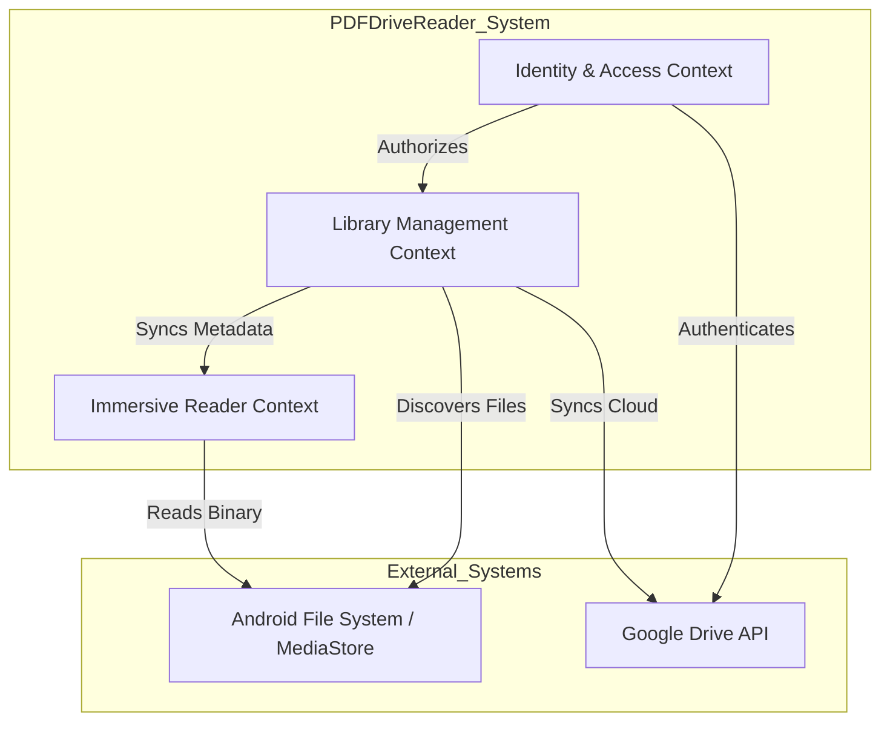

# Bounded Contexts & Domain Mapping

This document defines the logical boundaries of the PDFDriveReader application, mapping out the core subdomains and their interactions with external systems following Domain-Driven Design (DDD) principles.

## 1. Context Map
The application is divided into three primary bounded contexts, each with its own language and responsibilities.

## 2. Bounded Context Definitions

### 2.1 Library Management Context (Core)
The central hub for organizing and discovering documents.
- **Ubiquitous Language**: `DocumentMetadata`, `SourceType`, `SyncStatus`, `LocationPath`, `LocalScanner`.
- **Primary Responsibility**: Maintaining an accurate index of available PDF files from both local and cloud sources.
- **Key Entities**: `DocumentMetadata`.

### 2.2 Immersive Reader Context (Core)
The domain responsible for the actual consumption of content.
- **Ubiquitous Language**: `PdfDocument`, `PagePosition`, `ReadingDirection`, `ReadingSettings`, `ImmersiveUI`, `Tiling`.
- **Primary Responsibility**: High-fidelity rendering of PDF pages and persistence of user progress and preferences.
- **Key Aggregates**: `ReadingSession` (Root for Position and Settings).

### 2.3 Identity & Access Context (Supporting)
Handles the bridge between the user and cloud storage.
- **Ubiquitous Language**: `AuthSession`, `GoogleAccount`, `OAuthScope`, `SignInResult`.
- **Primary Responsibility**: Managing Google Sign-In lifecycles and providing authorized credentials to other contexts.

## 3. Context Relationships & Communication

| Relationship | Type | Description |
| --- | --- | --- |
| **Library -> Reader** | Customer/Supplier | The Reader depends on the Library to provide valid document metadata (URIs) to initiate a session. |
| **Auth -> Library** | Partnership | The Library context requires an active Auth session to trigger cloud synchronization. |
| **Reader -> Android OS** | Conformist | The Reader must conform to the native `PdfRenderer` and `ParcelFileDescriptor` protocols. |

## 4. Aggregate Boundaries & Consistency
To maintain integrity, cross-context consistency is handled as follows:
- **Eventually Consistent**: Synchronization from Google Drive or MediaStore updates the Library's SQLite cache, which is then reactively observed by the UI.
- **Strictly Consistent**: Reading position and settings are saved atomically within the Reader context to prevent progress loss.

## 5. Strategic Classification
- **Core Domain**: Library Management & Immersive Reader (Where the primary business value lies).
- **Generic Subdomain**: SQLite/Room Persistence, PDF Rendering (Standard technical requirements).
- **Supporting Subdomain**: Identity & Google Drive Integration.
