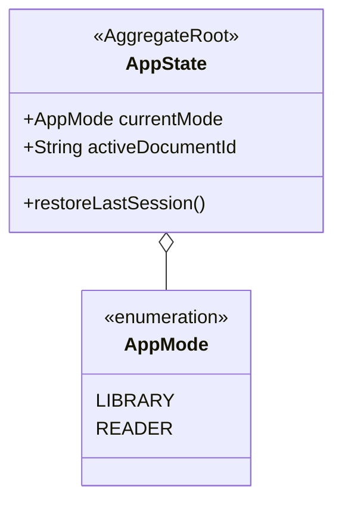
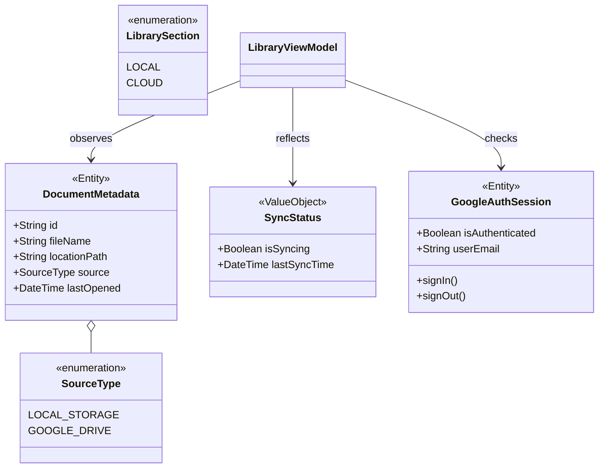
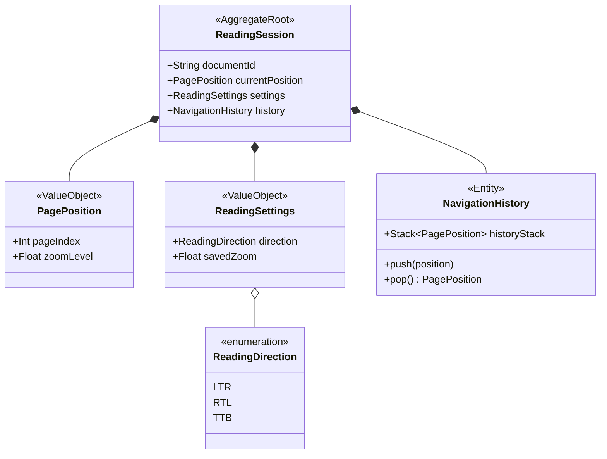
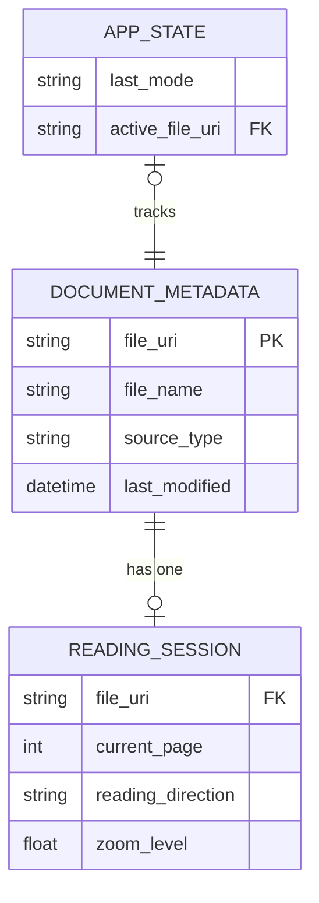
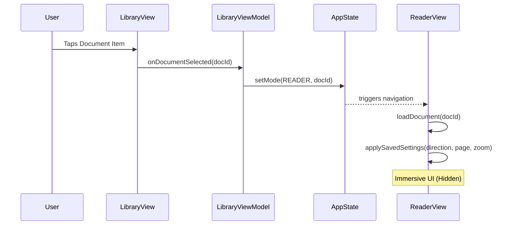

# Entity & Relationship Diagrams

This document defines the core domain entities and their relationships within the **Library** and **Reader** modes, as well as the global state that coordinates them.

## 1. Global Application State
The `AppState` aggregate root manages the high-level transition between the two primary modes.

## 2. Library Mode Entities
In Library Mode, the system focuses on document discovery, metadata indexing, and cloud synchronization.

## 3. Reader Mode Entities
Reader Mode manages the immersive experience, per-document settings, and navigation history.

## 4. Cross-Mode Relationship (ER Diagram)
This diagram illustrates how data persists across both modes via the shared SQLite cache.

## 5. Mode Transition Logic
The following sequence illustrates the transition from Library to Reader.

## Summary of Relations
- **One-to-One**: Every `DocumentMetadata` entry can have exactly one `ReadingSession` record (storing its specific settings).
- **Global Dependency**: Both `LibraryView` and `ReaderView` depend on the `AppState` to determine which UI to render and which file to load.
- **Composition**: A `ReadingSession` **owns** its `NavigationHistory` and `ReadingSettings`; they do not exist independently of a document session.
