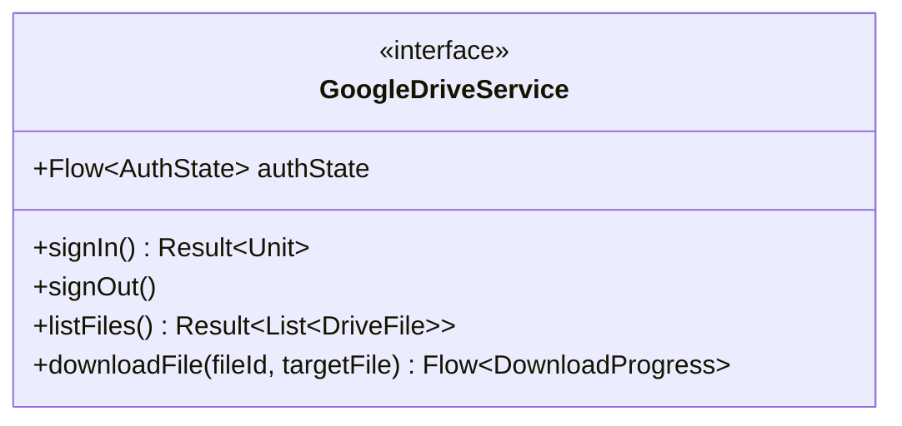

# Fake Google Drive API Design

To achieve fast and reliable unit tests, we use a **Fake Google Drive Service** instead of a Mock. This fake implementation mimics the behavior of the real Drive API using in-memory storage, allowing us to test synchronization, authentication, and error handling in isolation.

## 1. The Interface (`GoogleDriveService`)
The domain and data layers interact only with this abstraction.



## 2. The Fake Implementation (`FakeGoogleDriveService`)
The fake stores a mutable list of `DriveFile` objects and allows tests to manipulate the state (e.g., simulating a network failure or a pre-populated cloud drive).

### Core Properties
- `files`: `MutableList<DriveFile>` - Acts as the "Cloud Storage."
- `isAuthenticated`: `MutableStateFlow<Boolean>` - Simulates the login state.
- `failureMode`: `Exception?` - If set, all API calls will throw this exception.
- `downloadDelayMs`: `Long` - Simulates network latency for testing loading states.

### Behaviors
| Method | Fake Logic |
| --- | --- |
| `signIn()` | Sets `isAuthenticated` to true. Returns Success. |
| `listFiles()` | Returns the internal `files` list if authenticated, otherwise returns `AuthError`. |
| `downloadFile()` | Emits `Progress(0%)`, `Progress(50%)`, and `Success` with a delay. |
| `simulateNetworkError()` | Sets `failureMode = NetworkException()`. |

## 3. Test Usage Example (Kotlin DSL)
Tests can "prime" the fake with specific data before running the use case.

```kotlin
@Test
fun testSyncWithCloudFiles() = runTest {
    // 1. Setup Fake
    val fakeDrive = FakeGoogleDriveService().apply {
        addFile(DriveFile(id = "1", name = "Cloud.pdf", folder = "Books"))
        setAuthenticated(true)
    }
    
    // 2. Run Use Case
    val syncUseCase = SyncCloudLibrary(fakeDrive, localRepo)
    syncUseCase.execute()
    
    // 3. Verify Local Repository was updated
    val localFiles = localRepo.getDocuments().first()
    assertTrue(localFiles.any { it.fileName == "Cloud.pdf" })
}
```

## 4. Error Scenarios to Simulate
- **`AuthExpiredException`**: Triggered when a token is invalid. Verifies the UI shows the "Sign-In" button.
- **`QuotaExceededException`**: Verifies the app shows a specific error message.
- **`EmptyDrive`**: Verifies the Library shows the "No cloud files found" empty state.

## 5. Implementation Strategy
- **Location**: `app/src/test/java/.../fakes/FakeGoogleDriveService.kt`
- **Visibility**: Internal to the test source set.
- **DI Integration**: Used in Hilt's `TestModule` to replace the real service during instrumented tests.
