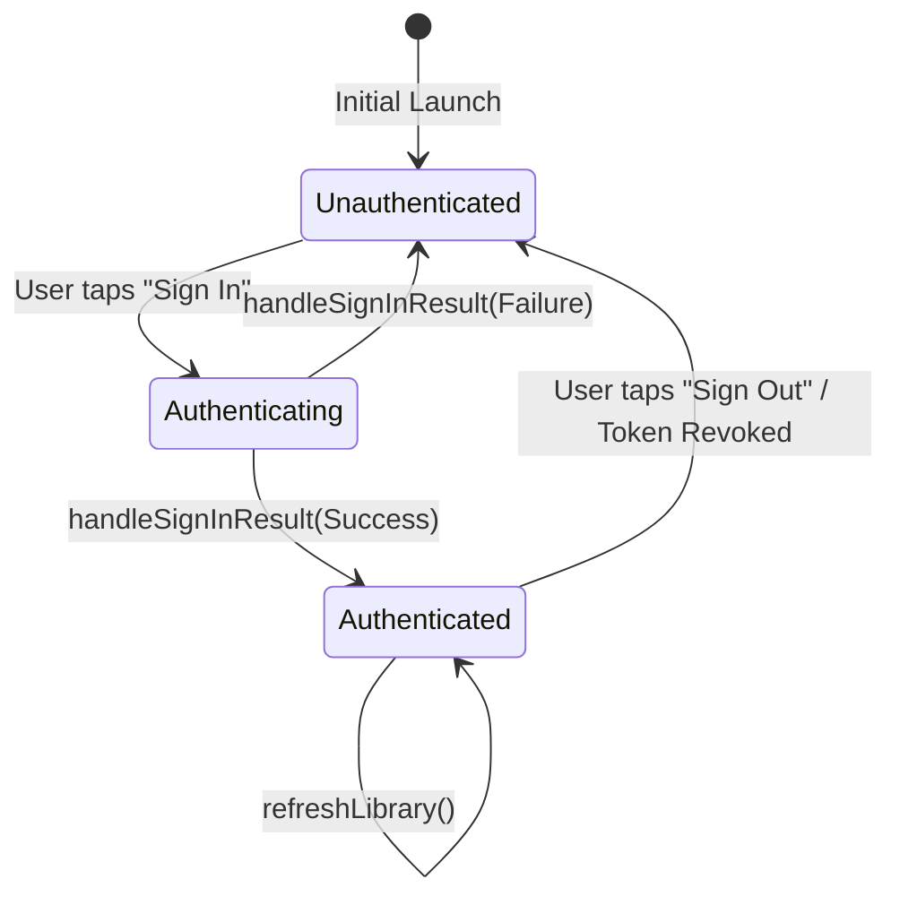
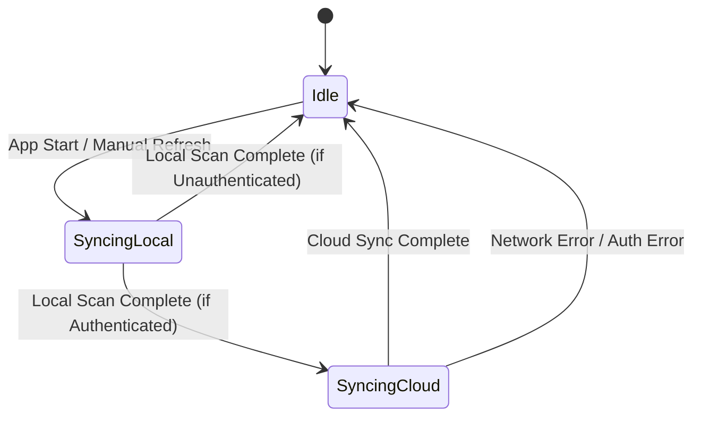
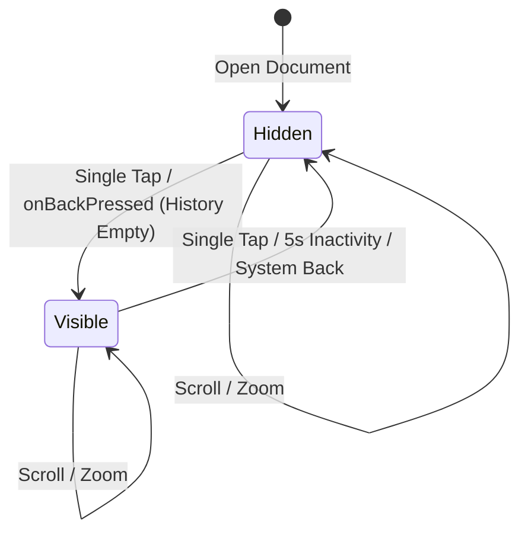

# State Transitions

This document defines the finite states and transitions for critical application components, ensuring consistent UI behavior across authentication and synchronization lifecycles.

## 1. Google Authentication Lifecycle
The `GoogleDriveService` manages the transition between authentication states.

### UI Impact
- **Unauthenticated**: Displays the `DriveAuthWall` (Sign-In button) in the Google Drive tab.
- **Authenticated**: Displays the list of cloud documents.

## 2. Library Synchronization Lifecycle
The `LibraryViewModel` coordinates background syncing between local and cloud sources.

### UI Impact
- **Syncing (any)**: The `Syncing Icon` is visible in the Top Bar.
- **Idle**: The `Syncing Icon` is hidden.

## 3. Reader Mode UI Visibility
The `ReaderViewModel` manages the toggle logic for the immersive reading experience.

## 4. Why the Sign-In Button persists (Implementation Gap)
If the sign-in button persists after a successful login, it indicates a breakdown in the transition from **Authenticating** to **Authenticated**. 

### Checklist for Implementation:
1. **Flow Collection**: The `LibraryViewModel` must collect the `authState` flow from `GoogleDriveService`.
2. **State Refresh**: `handleSignInResult` must emit a new value to the flow.
3. **Compose Observation**: The `LibraryScreen` must use `collectAsState()` to trigger a recomposition when the flow value changes.
