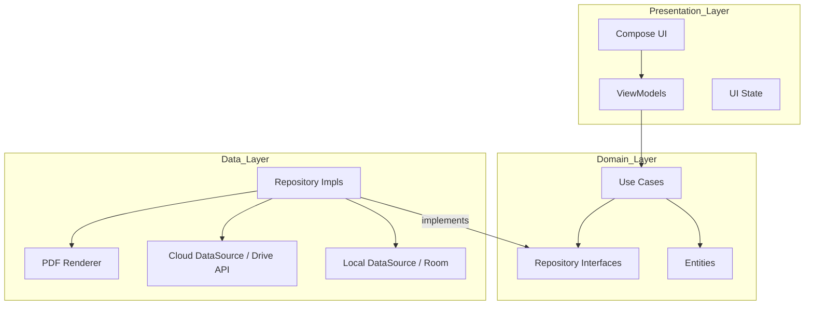
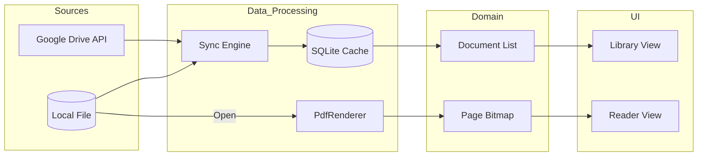
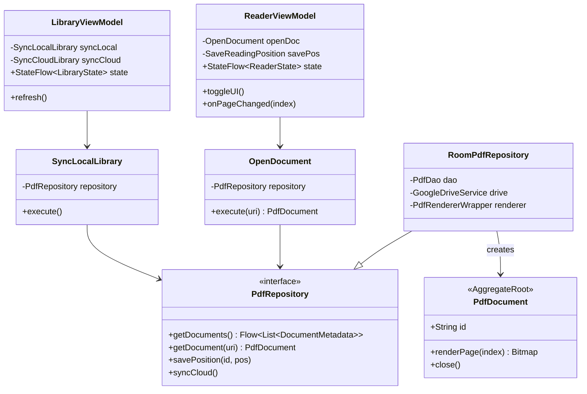

# System Architecture

This document provides a detailed view of the PDFDriveReader architecture, including its layers, data flow, and component relationships, following Clean Architecture and DDD principles.

## 1. Clean Architecture Layers
The system is divided into three primary layers to ensure a strict separation of concerns and dependency inversion.

## 2. Data Flow Diagram (DFD)
This diagram shows how a PDF document moves from its source (Local Storage or Google Drive) to the user's screen.

## 3. Detailed Class Diagram
This diagram defines the relationships and responsibilities of the key components in the system.

## 4. Dependency Injection (DI) Strategy
The system uses **Hilt** (built on Dagger) for dependency injection to ensure modularity and testability.
- **Singletons**: `RoomDatabase`, `GoogleDriveService`, and `SyncEngine` are managed as singletons.
- **Activity/ViewModel Scopes**: `PdfRepository` and `UseCases` are injected into ViewModels.
- **Testing**: Hilt allows replacing real DataSources with `Mocks` or `Fakes` during UI and integration testing.

## 5. Error Handling Model
The system uses a **Result Pattern** to propagate errors from the Data layer to the UI.
- **SyncResult**: `Success`, `Error(type, message)`, `Loading`.
  - *Error Types*: `NetworkError`, `AuthExpired`, `QuotaExceeded`.
- **RenderResult**: `Success(Bitmap)`, `Error(Exception)`.
  - *Error Types*: `InvalidPdf`, `FileLocked`, `OutOfMemory`.

## 6. Concurrency Strategy (Dispatchers)
To maintain a 60FPS UI, the app follows a strict dispatcher mapping:
- **Dispatchers.Main**: UI updates, Compose state transitions.
- **Dispatchers.IO**: SQLite queries, File I/O, Network calls (Drive API).
- **Dispatchers.Default**: PDF Rendering (CPU intensive), Bitmap processing, Thumbnail scaling.

## 7. Memory Management Policy
The app actively manages memory to prevent `OutOfMemory` errors during intensive reading:
- **LruCache**: Bitmaps for the current page and 1 page ahead/behind are kept in an `LruCache` (max 25% of available heap).
- **Purge Logic**: When a new document is opened, the previous document's `LruCache` is explicitly cleared.
- **OnLowMemory**: The app observes `ComponentCallbacks2` and clears all bitmap caches when the system is low on memory.

## 8. Interaction Summary
1.  **Dependency Rule**: Dependencies only point inwards. The `Presentation` layer depends on `Domain`, and the `Data` layer depends on `Domain` (interfaces).
2.  **Reactive Streams**: The `Data` layer exposes `Flow` objects from the SQLite cache, which the `Domain` use cases pass to the `ViewModels`. This ensures the UI is always in sync with the persistent state.
3.  **Immersive State**: The `ReaderViewModel` holds the `isUiVisible` boolean state, which is toggled by user taps and used by the `ReaderView` to show/hide overlays.
