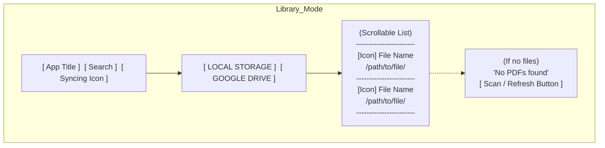
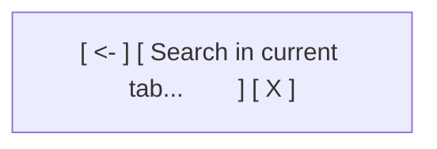
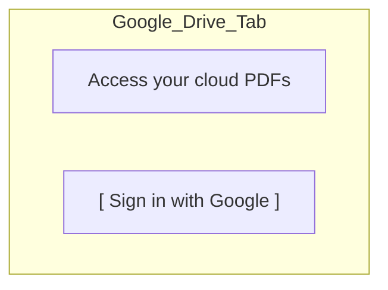
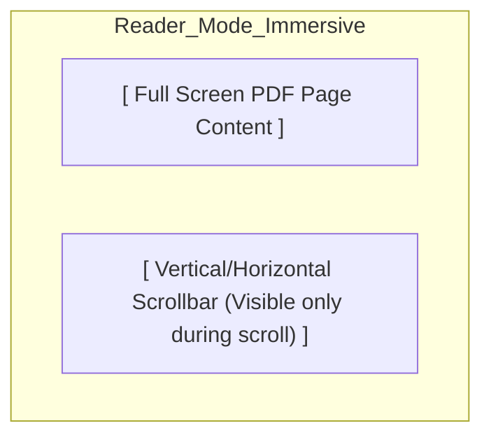
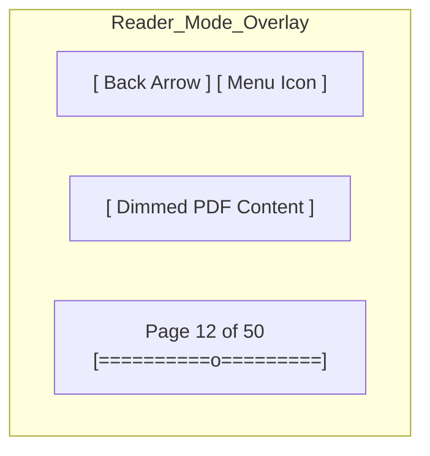
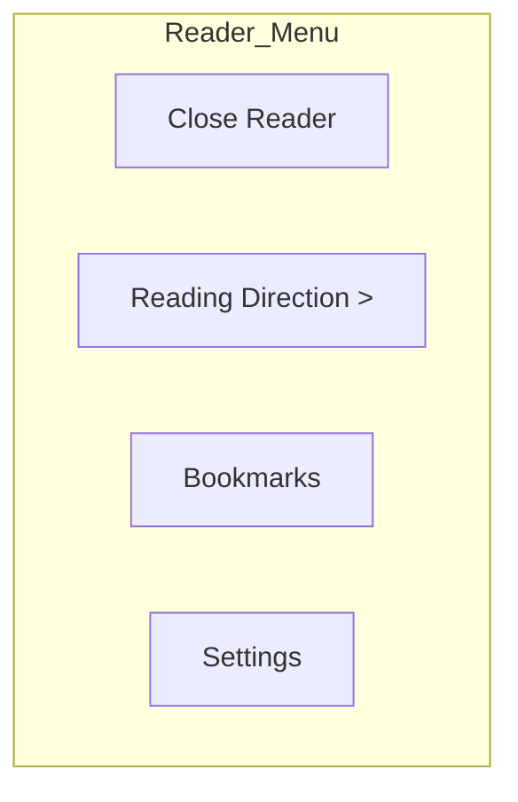
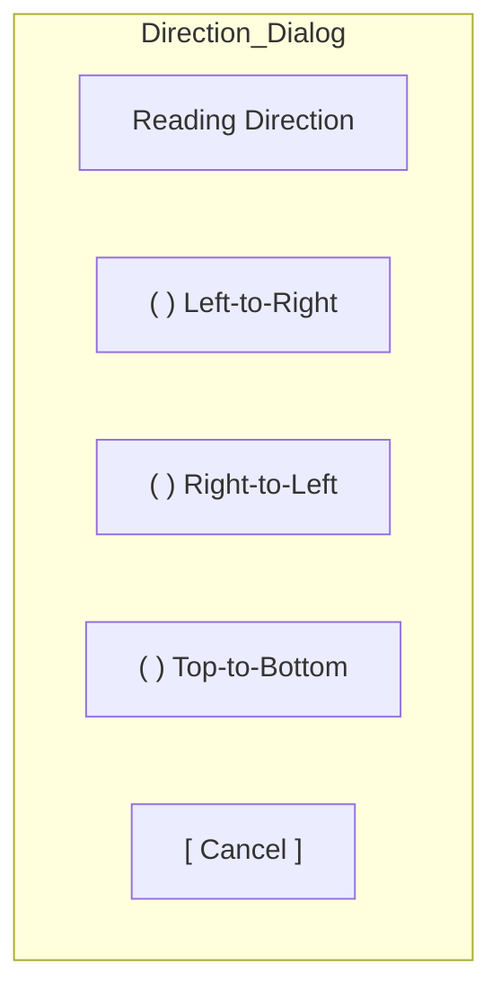

# Wireframes & UI Design

This document provides visual wireframes and layout specifications for the PDFDriveReader application, following Material Design 3 (M3) principles.

## 1. Library Mode (Document Selection)

### Main Layout
The Library uses a tabbed navigation to switch between local and cloud sources.

### Search Bar (Active)
When the search icon is tapped, the Top Bar transforms into a filter field.

### Google Drive - Unauthenticated
If the user is not signed in, the Google Drive tab displays a call-to-action.

---

## 2. Reader Mode (PDF Viewing)

### Immersive View (Default)
The screen is dedicated entirely to the PDF content. No UI elements are visible.

### UI Overlay (After Single Tap)
Tapping the screen reveals the navigation and menu controls.

---

## 3. Menus & Dialogs

### Reader Mode Menu
Appears in the top-right corner when the menu icon is tapped.

### Reading Direction Selection
A sub-menu or dialog for choosing the layout.

---

## 4. Interaction Specs (UX)

| Component | Interaction | Visual Feedback |
| --- | --- | --- |
| **List Item** | Tap | Ripple effect + Transition to Reader Mode |
| **PDF Page** | Single Tap | Toggle UI Overlay (Fade In/Out) |
| **PDF Page** | Double Tap | Reset Zoom to 100% (Animated) |
| **Scrollbar** | Drag | Haptic feedback on page change |
| **Sync Icon** | Visible | Rotating animation (Indeterminate) |

## 5. Transition Animations
Consistent motion is used to guide the user's focus and reinforce the reading direction.
- **Reading Directions**:
  - **LTR / RTL**: **Horizontal Slide** animation. Pages slide in from the right (LTR) or left (RTL) with a subtle shadow overlay to simulate depth.
  - **TTB**: **Smooth Vertical Scroll**. No discrete page transitions; the document flows as a single continuous canvas.
- **UI Overlay**:
  - **Toggle Action**: The Top Bar and Bottom Progress Bar use a **Fade-In / Fade-Out** combined with a **Vertical Slide** (8dp) for a "floating" appearance.
- **Mode Transition**: 
  - **Library to Reader**: **Shared Element Transition** on the PDF thumbnail or an **Expand** animation originating from the tapped list item.

## Layout Grid & Spacing (M3)
- **Margins**: 16dp (Screen edges)
- **Padding**: 8dp (Between list items)
- **Touch Targets**: All buttons/icons are minimum 48x48dp.
- **Typography**:
    - **App Title**: Title Large (22sp)
    - **File Name**: Body Large (16sp)
    - **File Path**: Body Small (12sp, Dimmed)
